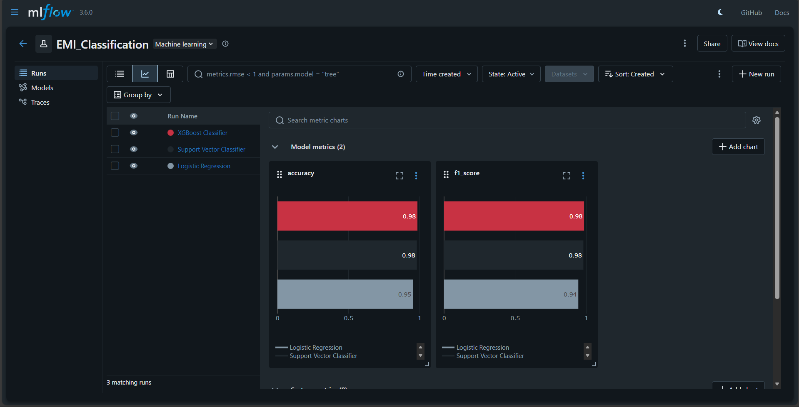
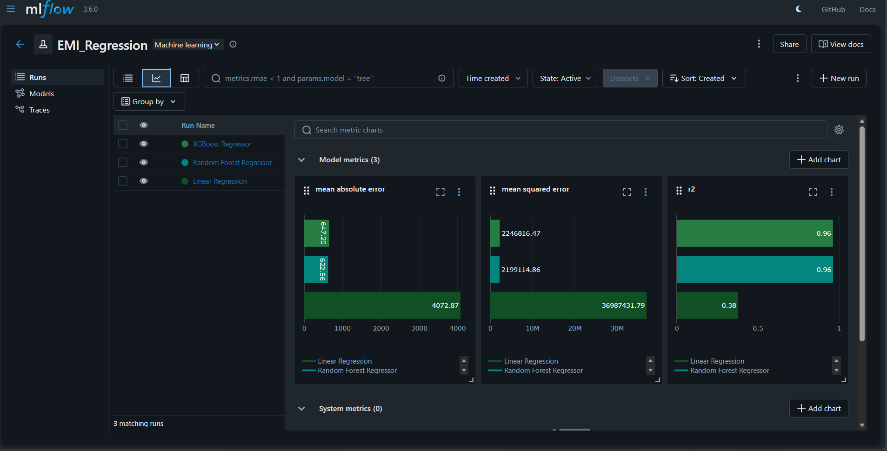
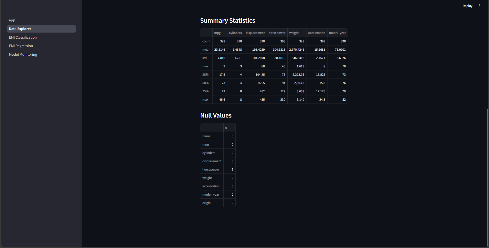
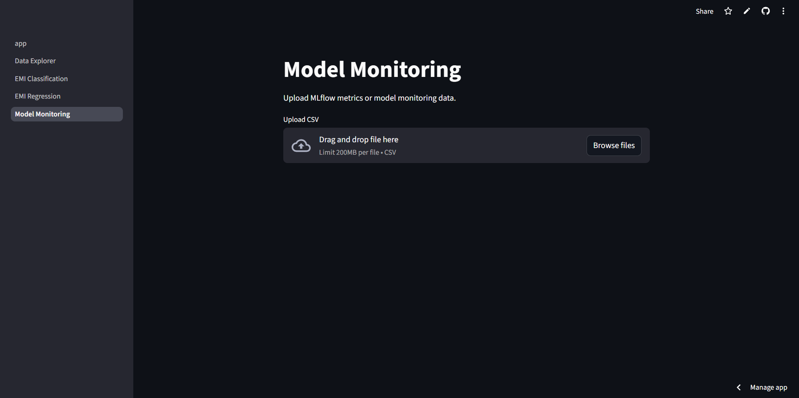

# ***EMI Predicting System – Machine Learning & Streamlit Application***

## Overview
The EMI Predicting System [project](https://github.com/mechahuman/EMI-Predicting-System) is an end-to-end machine learning application designed to analyze a customer's financial profile and determine:

1. Whether the customer is eligible for an EMI (Classification)  
2. The maximum EMI amount the customer can safely afford (Regression)

The system includes a trained machine learning pipeline, a multi-page Streamlit web application, and model management through MLflow for experiment tracking and artifact storage.

---

## Model Development

### MLflow Experiments
Two MLflow experiments were created and tracked:

- **EMI_Classification**  
  Used for developing and logging the multi-class classification model responsible for determining EMI eligibility.
  
  
  
- **EMI_Regression**  
  Used for developing and logging the regression model responsible for predicting the maximum EMI a customer can afford.
  
  
  
These experiments capture parameters, metrics, preprocessing pipelines, and versioned model artifacts through MLflow's tracking UI.

### MLflow Artifacts
The final trained models were exported from the MLflow experiment runs and included in the application under the `artifacts/` directory:

- Classification model: `artifacts/classification/model.pkl`  
- Regression model: `artifacts/regression/model.pkl`

These models are loaded at runtime within the Streamlit application for real-time prediction.

---

## Machine Learning Components

### 1. EMI Eligibility (Classification)
A multi-class classification model predicting whether a customer is:

- Eligible  
- High_Risk  
- Not_Eligible  

**Model Used:** XGBoost Classifier within a Scikit-Learn Pipeline  
**Input:** Complete financial profile including numeric, categorical, and engineered features  
**Output:** EMI eligibility class label  

---

### 2. Maximum EMI Prediction (Regression)
A regression model that estimates the maximum monthly EMI the customer can safely afford.

**Model Used:** XGBoost Regressor within a Scikit-Learn Pipeline  
**Output:** Continuous EMI value  

---

## Feature Engineering
The application computes several derived financial indicators before prediction:

- total_monthly_expenses  
- disposable_income  
- emi_to_income_ratio  
- debt_to_income_ratio  
- savings_ratio  
- loan_to_salary_ratio  
- expense_to_income_ratio  
- dependents_per_income  
- income_per_person  

These features replicate the structure used during model training.

---

## Streamlit Application

A multi-page Streamlit interface enables user input and real-time predictions using the MLflow-exported models.  
Pages include:

- EMI Eligibility Prediction  
- Maximum EMI Prediction  

The interface manages user inputs, computes engineered features, loads model artifacts, and returns prediction outputs.
<p align="center">
  
  
</p>

<p align="center">
  
  
</p>

<p align="center">
  
  
</p>

<p align="center">
  
  
</p>

*StreamLit Application:* https://emi-predicting-system-7nkersbses63i2qbmbv8g6.streamlit.app/

---

## Deployment

The application is deployed using Streamlit Cloud. Deployment features include:

- Integration with GitHub repository  
- Automatic rebuild on every push  
- Cloud execution environment for all model inference  
- No manual server configuration required  

Deployment process:

1. Code is pushed to the GitHub repository  
2. Streamlit Cloud pulls the latest commit  
3. Dependencies from `requirements.txt` are installed  
4. Application is executed and served publicly  

---

## Running the Application Locally

### Clone the repository
```bash
git clone https://github.com/<your-username>/<your-repo>.git
cd <your-repo>
```
### Installing dependencies
```bash
pip install -r requirements.txt
```
### Running the Application
```bash
streamlit run app.py
```
## Conclusion

The EMI Predicting System integrates machine learning, financial feature engineering, MLflow experiment tracking, and a fully interactive Streamlit application into a single, deployable solution. By combining classification and regression models, the system provides both EMI eligibility assessment and maximum EMI estimation with consistency and reliability. This project demonstrates the complete lifecycle of an applied machine learning system—from model development and artifact management to cloud deployment—offering a scalable and practical framework for real-world financial decision support.

